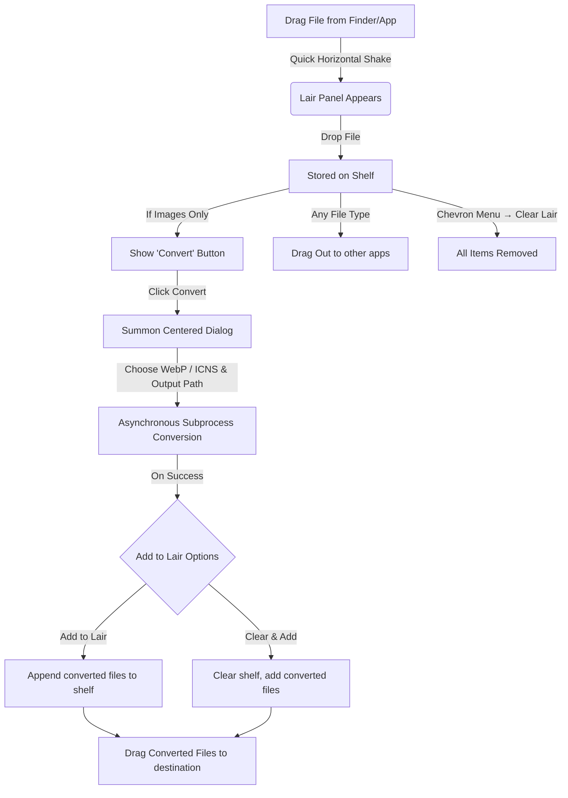

# Drag.on - macOS Productivity Drop Shelf & Image Converter

**Drag.on** (pronounced "Dragon") is a highly polished, non-sandboxed macOS Accessory utility designed to supercharge drag-and-drop workflows. It provides a temporary floating "shelf" (or "Lair") for files. Users can summon the Lair on demand by simply dragging any file and shaking it, or via a menu bar status item.

In addition to serving as a file shelf, Drag.on includes a native **Image Converter** that converts dropped images to **WebP** and **ICNS** formats in-place, instantly feeding converted files back onto the shelf for immediate drag-out.

---

## 🛠 Technology Stack

- **OS Platform**: macOS 14.6+ (Runs as an Accessory/Agent App, hidden from the Dock by default)
- **UI Frameworks**:
  - **SwiftUI**: Drives the main user interface overlay (`ShelfView`), empty states, close buttons, file counts, the convert panel (`ConvertView`), and all reusable UI components.
  - **AppKit (Cocoa)**: Manages window characteristics (`ShelfWindow` as a borderless `NSPanel`), the convert panel (`ConvertPanel` as a borderless `NSPanel`), global dragging/mouse tracking, system status items, and native multi-file dragging.
- **Image Conversion**: Uses native macOS command-line utilities `/usr/bin/sips` and `/usr/bin/iconutil` executed asynchronously via Foundation's `Process` class.
- **Persistence**: `UserDefaults` with JSON encoding and security-scoped bookmark data for persistent file resolution across system restarts and path movements.

---

## 📂 Codebase & Component Structure

### Core Application
- **`drag_onApp.swift`**: Main entry point. Hooks up the `AppDelegate` and hides the application icon from the macOS Dock (`NSApplication.activationPolicy = .accessory`).
- **`AppDelegate`**: Oversees the application lifecycle, registers the global drag monitoring timers, configures the status item menu, and manages the menu bar extras.

### Window Management & AppKit Bridge
- **`ShelfWindow.swift`**:
  - Subclasses `NSPanel` with a borderless, non-activating, and floating configuration to stay on top of all windows.
  - Configures an `NSVisualEffectView` with `.hudWindow` materials for a modern glassmorphism aesthetic.
  - **`DropTargetView`**: Captures incoming files (`.fileURL`) dragged into the window boundaries.
  - **`FilePileNSView`**: AppKit view placed under the SwiftUI hosting view. Renders up to 5 visual file cards styled as a stacked pile with shadows and organic rotations.
  - **`FileCardNSView`**: Handles mouseDown/dragged events to initiate native `NSDraggingSession` operations containing all files on the shelf. Dropping successfully clears the Lair.
  - **`FirstMouseHostingView`**: Special `NSHostingView` subclass that enables instantaneous interaction with SwiftUI buttons on a non-key panel window.

- **`ConvertPanel.swift`**:
  - Subclasses `NSPanel` with borderless, non-activating, and full-size-content-view configuration.
  - Dimensions: **320 × 380** pixels.
  - **Screen-centered**: On show, calculates the center of the active screen containing the Lair window (not positioned relative to the Lair).
  - **Focused**: Activates the application and makes itself the key window on appear, so it immediately receives keyboard and mouse focus.

### Reusable UI Components
- **`LairCircleButton.swift`**: A reusable circular icon button (30×30) with adaptive styling for light and dark backgrounds. Features fluid hover animations that scale up by 15% on hover with smooth opacity transitions. Used for close (`xmark`) and chevron (`chevron.down`) buttons throughout the Lair and Convert Panel.
- **`WandIcon.swift`**: A reusable wand icon view that uses `#available(macOS 15, *)` to show `wand.and.sparkles` (SF Symbols 6) on macOS 15+ and falls back to `wand.and.rays` on older macOS versions. Used in both the Lair's Convert button and the Convert Panel's "Convert Now" button.

### Interaction & Core Logic
- **`DragMonitor.swift`**: Polls the system mouse state at 60Hz. If a drag operation is active and contains file URLs, it feeds location data to `ShakeDetector`.
- **`ShakeDetector.swift`**: Processes mouse coordinates during drag operations to detect rapid horizontal reversals (shakes). Integrates an amplitude limit (150px) to distinguish shakes from typical window drag-outs.
- **`ShelfStore.swift`**: Observable state container managing the list of active `FileItem`s. Resolves system bookmarks upon launch and prunes missing items. Exposes `addFile(url:)`, `addFiles(urls:)`, `removeFile(id:)`, and `clearAll()`.
- **`ImageConverter.swift`**: Asynchronously handles image conversion workflows (WebP format and Apple `.icns` packages) using background subprocesses.

### Views
- **`ShelfView.swift`**: Main Lair overlay view. Contains the dashed container border (empty state only), top bar with close and chevron buttons, file count label, and convert button. The chevron button is wrapped in a `Menu` that provides a dropdown with a "Clear Lair" action.
- **`ConvertView.swift`**: Standalone converter dialog content showing format selection, output path, and a premium "Convert Now" button with glass reflection effects. Success screen displays ghost cards and side-by-side "Add to Lair" / "Clear & Add" actions.

---

## 🎨 Visual Design & HUD Sizing

### Lair (Shelf Window)
- **Footprint**: A modern portrait card measuring **260 × 320** pixels.
- **Outer Shell**: Highly rounded corners (26pt radius) backed by macOS `.hudWindow` vibrancy.
- **Inner Dropzone**: Clear container padded by 12pt margins (bottom/horizontal) and 48pt margin (top) with a clean, low-opacity dashed outline (`StrokeStyle(lineWidth: 1.5, dash: [6, 4])`). **The dashed guide automatically hides when files are loaded on the shelf**, allowing the visual card stack to shine cleanly.
- **Top & Bottom Padding Symmetry**: The top bar controls and bottom bar containers are aligned symmetrically with exactly **12pt horizontal margins**, creating unified design lines matching the dashed border outline guides.
- **Unified Circular Controls**: Close and Chevron buttons sit above the dashed border guide and are styled uniformly using the reusable `LairCircleButton` component. They feature responsive, fluid hover animations that scale them up by 15% on mouse entry.
- **Chevron Dropdown Menu**: The chevron button in the top-right wraps a `Menu` with a **"Clear Lair"** destructive action. Uses `.borderlessButton` menu style and hides the native menu indicator for a clean look while preserving the `LairCircleButton` visual as the trigger label.
- **Stacked Full-Width Bottom Actions**: When only images are loaded on the shelf, the bottom actions stack vertically inside a `VStack`, both taking the **full width** of the container guides (`maxWidth: .infinity`):
  - **File Count**: Frosted translucent capsule button (on top) matching the exact width and 32pt height of the Convert button.
  - **Convert**: Glowing, glossy "cloudy sky" style capsule button (on the bottom) featuring a white semi-translucent base, glowing sky-blue center, white border outline, and bold label with a `WandIcon` (availability-gated wand symbol).
- **Empty State**: Displays an inviting premium container with a central placeholder icon and "Drop Artifact here" copy, centered perfectly inside the dashed guide.
- **File State**: Previews the dropped file stack as rotating cards layered within the container boundaries without any dashed outline guides.

### Convert Panel
- **Footprint**: **320 × 380** pixels, borderless, rounded (20pt radius).
- **Background**: Permanently solid white. A sky/clouds image (`sky_clouds_bg`) is placed at the top and fades into the white base via a linear gradient mask.
- **Header**: Centered bold "Convert" title (24pt heavy) with a grey image count subtitle below. Close button (`xmark`) positioned absolute left using `LairCircleButton` with `isLightBackground: true`.
- **Format Selector**: Custom dropdown card styled consistently with the output card. Clicking opens a native `Menu` popover to select formats (WebP, ICNS, etc.).
- **Output Path**: Shows resolved output directory with a folder picker button. Detects web browser temp drops and redirects to `~/Downloads`.
- **"Convert Now" Button**: Premium sky-blue gradient capsule (`#4EA3FF → #95D7FD` bottom-to-top) with a 2px semi-transparent border, diagonal top-right glass reflection sheen (`.screen` blend mode), and large glowing drop shadow. Uses `WandIcon` for the icon.
- **Success Screen**: Checkmark, ghost card previews, side-by-side "Add to Lair" / "Clear & Add" capsule buttons, and a "Reveal in Finder" link.
- **Failure Screen**: Warning triangle, error message, dismiss button.

---

## 🔄 Interaction Flow & Image Conversion Pipeline

### 1. The Converter Setup
When the shelf contains only images (e.g. PNG, JPEG, HEIC, WebP, etc.), a sleek glowing **Convert** button appears with a `WandIcon`. Clicking it summons a screen-centered, highly focused dialog measuring **320 × 380** that:
1. **Uses a permanent white background**: All texts, input badges, borders, and actions use dark colors for contrast on the white canvas. A sky/clouds image decorates the top.
2. **Centered Header & Reusable Close Button**: The close "x" button is positioned on the **absolute left** using `LairCircleButton(isLightBackground: true)`. The bold **"Convert"** title and image count subtitle are centered.
3. **Format Selector Dropdown**: A custom picker card styled like the output card. Clicking it opens a native `Menu` to select formats.
4. **Glass-Reflective Action Button**: The "Convert Now" button features a sky-blue gradient, a diagonal top-right translucent `.screen`-blend sheen mimicking reflective glass, and is elevated by a soft, large glowing drop shadow. Displays a `WandIcon` for visual consistency with the Lair's convert button.
5. **Smart Output Path**: Toggle between "Same folder as source" (Default) and "Custom folder..." (via `NSOpenPanel`).

#### Smart Output Fallback (Browser / Temp Drops)
When a user drags an image directly from a web browser, the source path often points to a temporary cache directory (e.g. `/var/folders/`, `/Caches/com.google.Chrome/`). The converter **detects these paths automatically** and redirects the output to `~/Downloads` instead of the ephemeral cache folder. The UI clearly labels this: **"Downloads (Web Drop)"** so the user knows exactly where the file will land. This detection covers Safari, Chrome, Firefox, and Edge temp directories.

### 2. Native Conversion Under the Hood
- **Convert to `.webp`**:
  Invokes `sips -s format webp <input> --out <output>` for lightning-fast, native compression.
- **Convert to `.icns`**:
  1. Automatically resizes the source image to `1024x1024` using `sips` so any source image size works.
  2. Generates a temporary `.iconset` directory.
  3. Resamples the squared image into all standard Apple icon scales (16x16 up to 512x512@2x).
  4. Runs `iconutil -c icns <iconset>` to compile the final `.icns` file.
  5. Cleans up temporary artifacts.

### 3. Immediate Usability
Once converted, the new files are automatically added back into `ShelfStore` under one of two options:
- **Add to Lair**: Appends the newly converted files alongside any existing files on the shelf.
- **Clear & Add**: Clears the shelf first and then populates it exclusively with the new converted files.

A high-quality success state is presented, displaying **ghost cards** (miniature high-fidelity draggable previews) of the newly generated files. The user can immediately drag these WebP or Apple Icons directly *out* of the success screen to their target destination without ever opening Finder, or click **Reveal in Finder** to view them.

### 4. Quick Lair Management
The **chevron dropdown menu** in the top-right of the Lair provides quick actions:
- **Clear Lair** (destructive): Removes all items from the shelf instantly.
