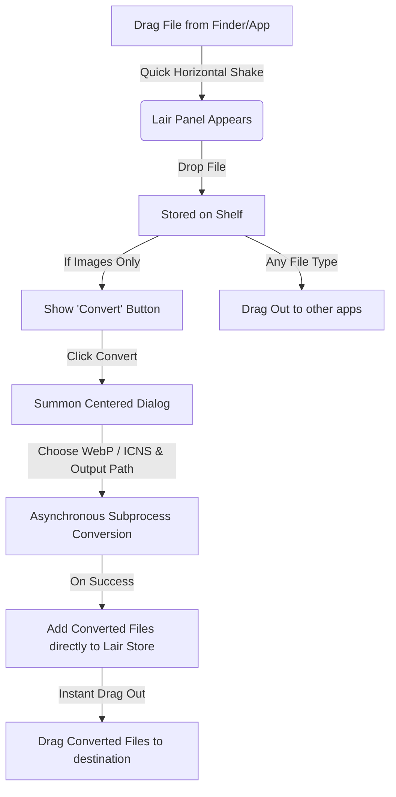

# Drag.on - macOS Productivity Drop Shelf & Image Converter

**Drag.on** (pronounced "Dragon") is a highly polished, non-sandboxed macOS Accessory utility designed to supercharge drag-and-drop workflows. It provides a temporary floating "shelf" (or "Lair") for files. Users can summon the Lair on demand by simply dragging any file and shaking it, or via a menu bar status item.

In addition to serving as a file shelf, Drag.on includes a native **Image Converter** that converts dropped images to **WebP** and **ICNS** formats in-place, instantly feeding converted files back onto the shelf for immediate drag-out.

---

## 🛠 Technology Stack

- **OS Platform**: macOS 14.6+ (Runs as an Accessory/Agent App, hidden from the Dock by default)
- **UI Frameworks**:
  - **SwiftUI**: Drives the main user interface overlay (`ShelfView`), empty states, close buttons, file counts, and the glassmorphic in-place conversion HUD.
  - **AppKit (Cocoa)**: Manages window characteristics (`ShelfWindow` as a borderless `NSPanel`), global dragging/mouse tracking, system status items, and native multi-file dragging.
- **Image Conversion**: Uses native macOS command-line utilities `/usr/bin/sips` and `/usr/bin/iconutil` executed asynchronously via Foundation's `Process` class.
- **Persistence**: `UserDefaults` with JSON encoding and security-scoped bookmark data for persistent file resolution across system restarts and path movements.

---

## 📂 Codebase & Component Structure

### Core Application
- **`drag_onApp.swift`**: Main entry point. Hooks up the `AppDelegate` and hides the application icon from the macOS Dock (`NSApplication.activationPolicy = .accessory`).
- **`AppDelegate`**: Oversees the application lifecycle, registers the global drag monitoring timers, configures the status item menu, and manages the menu bar extras.

### Window Management & AppKit Bridge
- **`ShelfWindow.swift`**:
  - Subclasses `NSPanel` with a borderless, non-activating, and floating configuration to stay on top of all windows.
  - Configures an `NSVisualEffectView` with `.hudWindow` materials for a modern glassmorphism aesthetic.
  - **`DropTargetView`**: Captures incoming files (`.fileURL`) dragged into the window boundaries.
  - **`FilePileNSView`**: AppKit view placed under the SwiftUI hosting view. Renders up to 5 visual file cards styled as a stacked pile with shadows and organic rotations.
  - **`FileCardNSView`**: Handles mouseDown/dragged events to initiate native `NSDraggingSession` operations containing all files on the shelf. Dropping successfully clears the Lair.
  - **`FirstMouseHostingView`**: Special `NSHostingView` subclass that enables instantaneous interaction with SwiftUI buttons on a non-key panel window.

### Interaction & Core Logic
- **`DragMonitor.swift`**: Polls the system mouse state at 60Hz. If a drag operation is active and contains file URLs, it feeds location data to `ShakeDetector`.
- **`ShakeDetector.swift`**: Processes mouse coordinates during drag operations to detect rapid horizontal reversals (shakes). Integrates an amplitude limit (150px) to distinguish shakes from typical window drag-outs.
- **`ShelfStore.swift`**: Observable state container managing the list of active `FileItem`s. Resolves system bookmarks upon launch and prunes missing items.
- **`ImageConverter.swift`**: Asynchronously handles image conversion workflows (WebP format and Apple `.icns` packages) using background subprocesses.

---

## 🎨 Visual Design & HUD Sizing

- **Footprint**: A modern portrait card measuring **260 x 320** pixels.
- **Outer Shell**: Highly rounded corners (26pt radius) backed by macOS `.hudWindow` vibrancy.
- **Inner Dropzone**: Clear container padded by 12pt margins (bottom/horizontal) and 48pt margin (top) with a clean, low-opacity dashed outline (`StrokeStyle(lineWidth: 1.5, dash: [6, 4])`). **The guide automatically hides when files are loaded on the shelf**, allowing the visual card stack to shine cleanly.
- **Top & Bottom Padding Symmetry**: The top bar controls and bottom bar containers are aligned symmetrically with exactly **12pt horizontal margins**, creating unified design lines matching the dashed border outline guides.
- **Unified Circular Controls**: Close and Chevron/Arrow buttons sit above the dashed border guide and are styled uniformly using the reusable `LairCircleButton` component. They feature responsive, fluid hover animations that scale them up by 15% on mouse entry.
- **Stacked Full-Width Bottom Actions**: When only images are loaded on the shelf, the bottom actions stack vertically inside a `VStack`, both taking the **full width** of the container guides (`maxWidth: .infinity`):
  - **File Count**: Frosted translucent capsule button (on top) matching the exact width and 32pt height of the Convert button.
  - **Convert**: Glowing, glossy "cloudy sky" style capsule button (on the bottom) featuring a white semi-translucent base, glowing sky-blue center, white border outline, and bold dark-blue label.
- **Empty State**: Displays an inviting premium container with a central placeholder icon and informative summons copy, centered perfectly inside the guide guidelines.
- **File State**: Previews the dropped file stack as rotating cards layered within the dashed container boundaries without any dashed outline guides.
- **"Convert" Action**: Summoned by clicking the glowing Convert button, opening a centered, focused dialog that automatically adapts to the system color scheme (pure white in Light mode, pure black in Dark mode).

---

## 🔄 Interaction Flow & Image Conversion Pipeline

### 1. The Converter Setup
When the shelf contains only images (e.g. PNG, JPEG, HEIC, WebP, etc.), a sleek glowing **Convert** button appears. Clicking it summons a screen-centered, highly focused dialog measuring **320 x 380** that:
1. **Adapts to System Theme**: Renders a solid white canvas in Light Mode and a solid black canvas in Dark Mode. All texts, input badges, borders, and actions adapt dynamically for legibility.
2. **Abstract Top Header**: Retains the sky-clouds vector background (`sky_clouds_bg`) fading smoothly into the base background via a linear gradient mask.
3. **Centered Header & Reusable Close Button**: repositioned the close "x" button to the **absolute left** of the header using `LairCircleButton`. Centered the bold **"Convert"** title and selected images subtitle perfectly in the middle, styling the file count as smaller and greyed out.
4. **Format Selector Dropdown**: Replaces the segmented control with a custom picker card styled like the output card. Clicking it opens a native borderless popover menu to select formats.
5. **Glass-Reflective Action Button**: The "Convert Now" button features a diagonal top-right translucent screen-blend sheen mimicking reflective glass, and is elevated by a soft, large glowing drop shadow.
6. **Smart Output Path**: Toggle between "Same folder as source" (Default) and "Custom folder..." (via `NSOpenPanel`).

#### Smart Output Fallback (Browser / Temp Drops)
When a user drags an image directly from a web browser, the source path often points to a temporary cache directory (e.g. `/var/folders/`, `/Caches/com.google.Chrome/`). The converter **detects these paths automatically** and redirects the output to `~/Downloads` instead of the ephemeral cache folder. The UI clearly labels this: **"Downloads (Web Drop)"** so the user knows exactly where the file will land. This detection covers Safari, Chrome, Firefox, and Edge temp directories.

### 2. Native Conversion Under the Hood
- **Convert to `.webp`**:
  Invokes `sips -s format webp <input> --out <output>` for lightning-fast, native compression.
- **Convert to `.icns`**:
  1. Automatically resizes the source image to `1024x1024` using `sips` so any source image size works.
  2. Generates a temporary `.iconset` directory.
  3. Resamples the squared image into all standard Apple icon scales (16x16 up to 512x512@2x).
  4. Runs `iconutil -c icns <iconset>` to compile the final `.icns` file.
  5. Cleans up temporary artifacts.

### 3. Immediate Usability
Once converted, the new files are automatically added back into `ShelfStore` under one of two options:
- **Add to Lair**: Appends the newly converted files alongside any existing files on the shelf.
- **Clear & Add**: Clears the shelf first and then populates it exclusively with the new converted files.

A high-quality success state is presented, displaying **ghost cards** (miniature high-fidelity draggable previews) of the newly generated files. The user can immediately drag these WebP or Apple Icons directly *out* of the success screen to their target destination without ever opening Finder, or click **Reveal in Finder** to view them.
