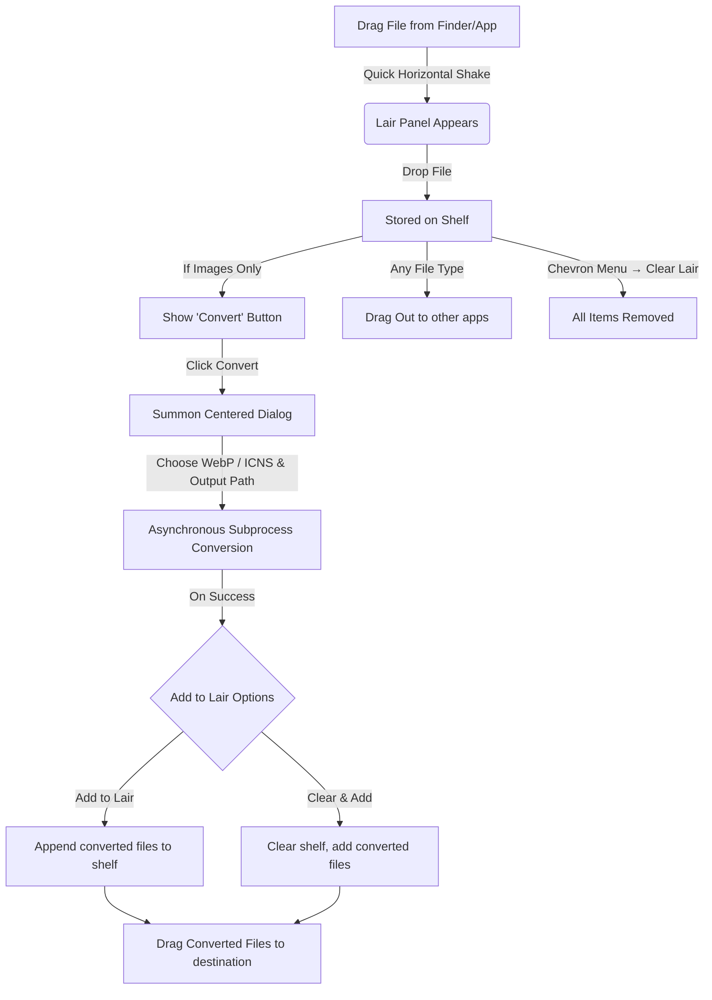

# Drag.on - macOS Productivity Drop Shelf & Image Converter

**Drag.on** (pronounced "Dragon") is a highly polished, non-sandboxed macOS Accessory utility designed to supercharge drag-and-drop workflows. It provides a temporary floating "shelf" (or "Lair") for files. Users can summon the Lair on demand by simply dragging any file and shaking it, or via a menu bar status item.

In addition to serving as a file shelf, Drag.on includes a native **Image Converter** that converts dropped images to **WebP**, **ICNS**, **PNG**, **JPEG**, **ICO**, and **PDF** formats in-place, instantly feeding converted files back onto the shelf for immediate drag-out.

---

## 🛠 Technology Stack

- **OS Platform**: macOS 14.6+ (Runs as an Accessory/Agent App, hidden from the Dock by default via `activationPolicy = .accessory`).
- **UI Frameworks**:
  - **SwiftUI**: Drives the main user interface overlay (`LairView`), management grid (`FileGridCell`), empty states, close buttons, file counts, the convert panel (`ConvertView`), settings (`SettingsView`), and all reusable UI components.
  - **AppKit (Cocoa)**: Manages window characteristics (`LairWindow` and `ConvertPanel` as borderless `NSPanel` subclasses), global dragging/mouse tracking, system status items, context menus, and native multi-file dragging.
- **Image Conversion**: Uses native macOS command-line utilities `/usr/bin/sips` and `/usr/bin/iconutil` executed asynchronously via Foundation's `Process` class, alongside `libwebp` wrapper for direct encoding and `CGImageDestination` for bitmap structures.
- **Persistence**: `UserDefaults` with JSON encoding and security-scoped bookmark data for persistent file resolution across system restarts and path movements.
- **Concurrency & Concurrency Safety**: Developed under Swift 6 strict concurrency checks. Implements thread-safe cache transitions (`OSAllocatedUnfairLock`), actors for service pipelines, and asynchronous off-main-thread task groups.

---

## 📂 Codebase & Component Structure

### Core Application
- **[DragOnApp.swift](file:///Users/assimgenshi/Documents/2.coding%20project/drag.on/drag.on/App/DragOnApp.swift)**:
  - Main entry point of the app.
  - Registers the `AppDelegate` class via `@NSApplicationDelegateAdaptor`.
  - Sets the application's activation policy to `.accessory` upon launch, removing the app icon from the macOS Dock.
- **[AppDelegate.swift](file:///Users/assimgenshi/Documents/2.coding%20project/drag.on/drag.on/App/AppDelegate.swift)**:
  - Manages the application lifecycle.
  - Instantiates `LairStore`, `ImageConverter`, and `DragMonitor`.
  - Configures the system menu bar status item (status icon, custom drop target, click interactions).
  - Starts the `DragMonitor` global mouse polling.
  - Observes the `ShakeDetector` callback to show the floating `LairWindow` under the cursor.

### Window Management & AppKit Bridge
- **[LairWindow.swift](file:///Users/assimgenshi/Documents/2.coding%20project/drag.on/drag.on/Windows/LairWindow.swift)**:
  - Subclasses `NSPanel` with a borderless, non-activating, and floating configuration to stay on top of all windows.
  - Uses `NSVisualEffectView` with `.hudWindow` materials for a modern glassmorphism aesthetic.
  - Tracks whether the window was summoned by a shake action to trigger auto-hiding when a drag session ends (`wasShownByShake` state).
  - Adjusts its geometry dynamically based on active modes:
    - **Standard mode**: `260 × 320`
    - **Compact mode**: `200 × 260`
    - **Management view**: `360 × 440`
  - Leverages Swift `withObservationTracking` to adapt its interface size, bounds, and layout dynamically.
- **[ConvertPanel.swift](file:///Users/assimgenshi/Documents/2.coding%20project/drag.on/drag.on/Windows/ConvertPanel.swift)**:
  - Subclasses `NSPanel` with borderless, non-activating, and full-size-content-view configuration.
  - Dimensions: **320 × 380** pixels with a corner radius of `20pt`.
  - Positions itself in the center of the active screen containing the Lair window.
  - Forces application activation and makes itself the key window on appear to receive immediate focus.
- **[DropTargetView.swift](file:///Users/assimgenshi/Documents/2.coding%20project/drag.on/drag.on/Windows/DropTargetView.swift)**:
  - AppKit view capturing incoming dragging sessions (`.fileURL`, `.URL`, `.string`).
  - Triggers haptic feedback (`.alignment`) via `LairWindow` when an external drag enters the view boundary.
  - Forwards local drops to `LairStore.addFilesAsync(urls:)` and browser drops/strings to `LairStore.addWebDrop(url:)`.
- **[FirstMouseHostingView.swift](file:///Users/assimgenshi/Documents/2.coding%20project/drag.on/drag.on/Windows/FirstMouseHostingView.swift)**:
  - A subclass of `NSHostingView` that allows SwiftUI buttons to respond to a single click even when the panel window is not currently active/key.
  - Handles drop target registration and forwards drag session inputs to the `LairStore`.
- **[FilePileView.swift](file:///Users/assimgenshi/Documents/2.coding%20project/drag.on/drag.on/Windows/FilePileView.swift)**:
  - AppKit view (`FilePileNSView`) placed under the SwiftUI hosting view.
  - Renders up to 5 visual file cards styled as a stacked pile with shadow overlays and organic rotations (configured as a fixed offset array `[0, -5, 4, -3, 6]`).
  - Manages card recycling, animations, and coordinates layouts based on whether standard, compact, or convert modes are active.
  - Runs drop animations via `CABasicAnimation` scaling from 1.15x to identity.
- **[FileCardView.swift](file:///Users/assimgenshi/Documents/2.coding%20project/drag.on/drag.on/Windows/FileCardView.swift)**:
  - AppKit view (`FileCardNSView`) representing a single card on the pile.
  - Implements `NSDraggingSource` to facilitate dragging a file *out* of the Lair.
  - Sets cards to be transparent hit-test targets during active external drags, delegating drop resolution to the underlying `FilePileNSView`.
  - Controls card fade-outs when active drags begin and handles the custom contextual menu.
- **[DragSourceHelper.swift](file:///Users/assimgenshi/Documents/2.coding%20project/drag.on/drag.on/Windows/DragSourceHelper.swift)**:
  - `NSViewRepresentable` bridging AppKit mouse tracking to SwiftUI grid cells inside the management panel.
  - Intercepts clicks, toggle highlights, hover events, and triggers a multi-file drag-out session (`beginDraggingSession(with:event:source:)`) if the user drags a selection.
  - Builds a comprehensive contextual right-click menu tailored to files or folders, offering actions like Open, Open with Application, Open in Terminal (supporting Terminal, iTerm2, and Warp), Reveal in Finder, Copy Path, Rename, Duplicate, Compress (ZIP creation via `/usr/bin/ditto`), and Convert.

### Services & Interaction Logic
- **[DragMonitor.swift](file:///Users/assimgenshi/Documents/2.coding%20project/drag.on/drag.on/Services/DragMonitor.swift)**:
  - Polls the system mouse state at **60Hz** (every 16ms) during active drags.
  - Offloaded to a dedicated high-priority serial queue (`com.yokai.drag-on.drag-monitor` with `.userInteractive` QoS) to prevent disk I/O and synchronous IPC pasteboard checks from hitching the main thread.
- **[ShakeDetector.swift](file:///Users/assimgenshi/Documents/2.coding%20project/drag.on/drag.on/Services/ShakeDetector.swift)**:
  - Aggregates high-frequency coordinate samples (up to 40 samples in a 0.5s window).
  - Processes horizontal velocity (requires `minVelocity = 300.0` px/s) and tracks direction changes (reversals) to detect shakes.
  - Implements a horizontal boundary amplitude limit (`maxAmplitude = 150.0` px) to ignore standard horizontal drags, and integrates a cooldown period (`1.5s`).
- **[LairStore.swift](file:///Users/assimgenshi/Documents/2.coding%20project/drag.on/drag.on/Services/LairStore.swift)**:
  - Central manager of `FileItem` objects, conforming to `FileStoring`.
  - Serializes items to/from `UserDefaults` via JSON.
  - Resolves security-scoped bookmark data on launch and automatically prunes stale files.
  - Performs non-blocking asynchronous bookmark creation via a Swift `TaskGroup` inside `addFilesAsync(urls:)`.
  - Supports restoring the previous non-empty shelf contents (`restorePreviousLair()`).
- **[WebDropService.swift](file:///Users/assimgenshi/Documents/2.coding%20project/drag.on/drag.on/Services/WebDropService.swift)**:
  - Actor-isolated utility that handles downloading images dropped from web browsers.
  - Performs downloads via `URLSession.shared.download`.
  - Resolves filenames from headers/URLs, maps MIME types to extensions, and guarantees file name uniqueness at the destination folder.
- **[ImageConverter.swift](file:///Users/assimgenshi/Documents/2.coding%20project/drag.on/drag.on/Services/ImageConverter.swift)**:
  - Main-actor-isolated coordinator bridging the conversion pipeline to the SwiftUI UI state.
  - Parses file items into `ConversionJob` parameters, generates `ResolvedOutputInfo`, and instantiates `ConversionQueue` to process files asynchronously.
- **[ConversionQueue.swift](file:///Users/assimgenshi/Documents/2.coding%20project/drag.on/drag.on/Services/ConversionQueue.swift)**:
  - Actor-isolated queue processing conversion tasks sequentially.
  - Sequentially validates source folders and files, handles SVG pre-rasterization pipelines, executes overwrite policies (Auto-rename, Overwrite, Skip), verifies the output integrity, and reports updates to the UI.
- **[ConversionValidator.swift](file:///Users/assimgenshi/Documents/2.coding%20project/drag.on/drag.on/Services/ConversionValidator.swift)**:
  - Validates `ConversionJob` entries. Checks path access, write permissions on output directories, file size limits (generates a warning above 50MB), and format compatibility.
- **[SVGRasterizer.swift](file:///Users/assimgenshi/Documents/2.coding%20project/drag.on/drag.on/Services/SVGRasterizer.swift)**:
  - Handles vector format pre-processing. Loads vector assets natively using AppKit's `NSImage`.
  - Computes scale-preserving resolutions (maximum 2048px) and draws the vectors into a `CGBitmapContext` to write temporary PNG inputs for down-stream converters.
- **[ThumbnailCache.swift](file:///Users/assimgenshi/Documents/2.coding%20project/drag.on/drag.on/Services/ThumbnailCache.swift)**:
  - Main-actor-isolated cache wrapping an `NSCache<NSString, CachedThumbnail>`.
  - Wraps non-`Sendable` `NSImage` items inside a thread-safe `SendableImage` structure to cross concurrency boundaries safely.
  - Leverages `QLThumbnailGenerator` inside background threads, falling back to downscaled `CGImageSource` objects for raw images or file system icons.

### SwiftUI Views & Design Components
- **[LairView.swift](file:///Users/assimgenshi/Documents/2.coding%20project/drag.on/drag.on/Views/Lair/LairView.swift)**:
  - Primary shelf content view. Manages top navigation, empty states, dashed borders, file counters, and summon transitions.
  - Handles the Lair Manager grid overlay displaying item selections and batch operational buttons (Deselect, Open, Reveal, Convert, Delete).
- **[LairCircleButton.swift](file:///Users/assimgenshi/Documents/2.coding%20project/drag.on/drag.on/Views/Lair/LairCircleButton.swift)**:
  - A highly polished circular icon button (30x30) with adaptive background styles for light and dark backgrounds.
  - Scales up by 15% on hover with custom spring animations.
- **[ConvertView.swift](file:///Users/assimgenshi/Documents/2.coding%20project/drag.on/drag.on/Views/Convert/ConvertView.swift)**:
  - Dialog showing selected image card stacks, format selection menu popovers, quality configuration slider, and the reflective "Convert Now" button.
- **[ConvertProgressView.swift](file:///Users/assimgenshi/Documents/2.coding%20project/drag.on/drag.on/Views/Convert/ConvertProgressView.swift)**:
  - Shows conversion progress with a detailed circular progress ring, phase descriptions, and file status metrics.
- **[ConvertSuccessView.swift](file:///Users/assimgenshi/Documents/2.coding%20project/drag.on/drag.on/Views/Convert/ConvertSuccessView.swift)**:
  - Complete confirmation panel.
  - Displays draggable preview cells ("ghost cards") of the outputs, a "Reveal in Finder" action, and destination configuration buttons ("Clear & Add" or "Add to Lair").
- **[ConvertFailureView.swift](file:///Users/assimgenshi/Documents/2.coding%20project/drag.on/drag.on/Views/Convert/ConvertFailureView.swift)**:
  - Displays error logs, failed item details, warning symbols, and a dismiss link.
- **[GhostCardView.swift](file:///Users/assimgenshi/Documents/2.coding%20project/drag.on/drag.on/Views/Components/GhostCardView.swift)**:
  - Draggable preview thumbnail displayed inside the success state scroll area.
- **[AsyncThumbnailView.swift](file:///Users/assimgenshi/Documents/2.coding%20project/drag.on/drag.on/Views/Components/AsyncThumbnailView.swift)**:
  - Helper view that asynchronously triggers, loads, and draws cached thumbnails.
- **[WandIcon.swift](file:///Users/assimgenshi/Documents/2.coding%20project/drag.on/drag.on/Views/Components/WandIcon.swift)**:
  - Availability-gated vector component mapping `wand.and.sparkles` on macOS 15+ and falling back to `wand.and.rays` on older operating systems.
- **[CapsuleSlider.swift](file:///Users/assimgenshi/Documents/2.coding%20project/drag.on/drag.on/Views/Components/CapsuleSlider.swift)**:
  - Custom horizontal slider for adjusting output compression quality with precise hover tracks and progress indicators.
- **[SettingsView.swift](file:///Users/assimgenshi/Documents/2.coding%20project/drag.on/drag.on/Views/Settings/SettingsView.swift)**:
  - Arc browser-style visual preference view.
  - Configures the underlying `NSWindow` to look chromeless with customized traffic light button translation shifts (via `SettingsWindowConfigurator`).
  - Supports configuring launch behavior (via `SMAppService`), preferred terminals, download folders, sensitivity sliders, output formats, compact windows, and System/Light/Dark custom theme cards.

### Utility Structures
- **[LairConstants.swift](file:///Users/assimgenshi/Documents/2.coding%20project/drag.on/drag.on/Utilities/LairConstants.swift)**:
  - Absolute dimensions, corner radii, material states, margins, menu constants, and icons utilized by windows and dialog structures.
- **[ImageExtensions.swift](file:///Users/assimgenshi/Documents/2.coding%20project/drag.on/drag.on/Utilities/ImageExtensions.swift)**:
  - Declares the `SupportedImageExtensions` lookup set to determine format validation.
- **[Color+Hex.swift](file:///Users/assimgenshi/Documents/2.coding%20project/drag.on/drag.on/Utilities/Color+Hex.swift)**:
  - Extension for initializing SwiftUI `Color` views from hex strings.
- **[View+Cursor.swift](file:///Users/assimgenshi/Documents/2.coding%20project/drag.on/drag.on/Utilities/View+Cursor.swift)**:
  - Introduces `pointerCursor()` modifiers to display AppKit hand pointers on hover.
- **[SettingsOpener.swift](file:///Users/assimgenshi/Documents/2.coding%20project/drag.on/drag.on/Utilities/SettingsOpener.swift)**:
  - A thread-safe bridge to open the SwiftUI settings panel from the AppKit `AppDelegate` environment.
- **[Logger+App.swift](file:///Users/assimgenshi/Documents/2.coding%20project/drag.on/drag.on/Utilities/Logger+App.swift)**:
  - Subsystem-based logger category declarations.

---

## 🎨 Visual Design & Layout Architecture

### Lair Shelf Overlay
- **Layout Profiles**:
  - **Standard**: `260 × 320` frame, `26pt` corner radius, centered stacked previews, full-width actions at the bottom.
  - **Compact**: `200 × 260` frame, `26pt` corner radius, smaller previews, file counts inside a simplified header bar.
  - **Management**: `360 × 440` frame, `26pt` corner radius, multi-column adaptive layout grids.
- **Background Vibrant Layer**: Uses `.hudWindow` vibrancy. Inactive windows are styled with custom border colors (`Color("border-color")`), which adapt to glowing blue highlights (`Color.skyblue`) during active drag operations.
- **Empty Dashed State**: Outer outline bordered with a dotted border (`StrokeStyle(lineWidth: 1.5, dash: [9, 4])`) padded from margins, which automatically fades out when files are present.
- **Bottom Stack**: Combines frosted action pills (32pt heights) that adaptively show image conversion buttons when images are on the shelf.

### Image Converter Panel
- **Frame Spec**: `320 × 380` boundary with a solid white background and a gradient-masked top clouds banner (`sky_clouds_bg`) on light mode.
- **Header**: Absolute-positioned close button (`LairCircleButton` with `isLightBackground: true`) on the left, with title strings centered.
- **Input Fields**: Input badges styled with thin border indicators, including chevron dropdowns and folder selection popovers.
- **Convert Now Button**: Designed with a high-contrast sky-blue gradient (`#4EA3FF → #95D7FD`), diagonal semi-translucent glass sheen overlays, and large glowing shadows.

---

## 🔄 Interaction Flow & Conversion Engine Pipeline

### 1. Smart Output Routing (Web Drops)
When images are dragged directly from a web browser (e.g. Chrome, Safari, Firefox), their local paths resolve to temporary system cache folders (e.g., `/var/folders/`, `/Caches/`). The coordinator detects these paths automatically and redirects outputs to the local `~/Downloads` directory (displayed in the UI as **"Downloads (Web Drop)"**).

### 2. Format Conversion Internals (`ConversionEngine`)
- **WebP**: Encodes pixel data via `WebPEncoder` using memory-mapped RGBA pixel buffers generated from `CGImage` sources.
- **PNG / JPEG**: Renders bitmaps using macOS `CGImageDestination` utilities.
- **ICNS**: 
  1. Square-crops input images using `sips --cropToHeightWidth`.
  2. Resamples outputs to `1024x1024` using `sips --resampleHeightWidth`.
  3. Creates a temporary `.iconset` folder structure.
  4. Resamples the image to all Apple standard icon scales (16x16 up to 512x512@2x) using `sips`.
  5. Asynchronously executes `/usr/bin/iconutil -c icns` to compile the final `.icns` package.
- **ICO**: Generates multi-size Microsoft ICO files (incorporating sizes 16, 24, 32, 48, 64, 128, 256) inside a single package using `CGImageDestination`.
- **PDF**: Renders bitmap images into a single PDF page context. For SVG vector formats, it uses `NSGraphicsContext` to execute vector-preserving PDF conversions.
